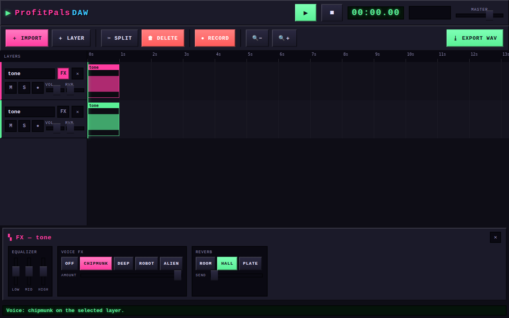

# ProfitPals DAW

A **very simple, playful DAW for the Steam Deck** (desktop mode). Think "the core
ideas of Ableton, but as approachable as the Hasbro *Play It Now*" — chunky
toy-like controls wrapped in retro pixel / DOOM-status-bar art.

Load any audio file, stack it into layers, cut and split clips on a timeline,
record from the mic, and mix it down — with an iZotope-style convolution reverb
send on every layer and a master limiter for the final level.



## Status

**Working now (v1 + v2):**

- 🎚️ Import any audio file (WAV/MP3/OGG/FLAC — anything the WebView can decode) and
  layer it onto its own track.
- ✂️ Non-destructive **cut / split / trim / move / delete** on a timeline.
- 🎙️ **Record** from the mic / line-in straight onto an armed layer.
- 🎛️ Per-layer **volume, mute, solo** and a **reverb send**.
- 🎚️ **Per-layer FX rack** (the "FX" button on each layer):
  - **3-band EQ** (low shelf / mid peak / high shelf).
  - **Voice manipulation** — an iZotope-style digital-voice unit with
    **Chipmunk / Deep / Robot / Alien** presets (pitch shifting via a custom
    `AudioWorklet`, ring modulation via a native oscillator) plus an amount knob.
  - **Reverb** send with selectable **Room / Hall / Plate** spaces.
- 🌫️ Shared convolution **reverb** bus (synthesised impulse responses).
- 📈 **Master limiter** + level meter ("mastering level").
- 💾 **Export** the whole mix to a WAV file — rendered offline through the *same*
  FX graph you hear (native save dialog under Tauri).

**Next (v3 ideas):**

- Formant-corrected pitch shifting and real IR reverb files.
- Movable FX order / more inserts per layer.
- Steam Deck gamepad navigation.

## Architecture

Web tech (TypeScript + **Web Audio API** for sound, HTML5 **Canvas** for the
pixel art) shipped as a small native Linux binary via **Tauri v2**.

```
public/
  pitch-processor.js  AudioWorklet: dual-delay-line pitch shifter (voice FX)
src/
  audio/     AudioEngine (AudioContext + master bus + reverb), TrackChannel
             (per-layer fader + EQ + voice FX + send), Track/Clip model,
             pure edit ops (split/trim/move), WAV encoder, reverb IR generator
  fx/        Voice presets + param mapping (pure, unit-tested)
  render/    waveform peak extraction + caching
  state/     Svelte stores + all app actions (the UI <-> engine seam)
  ui/        Svelte components: App, Transport, Toolbar, Timeline, TrackHead, FxRack
src-tauri/   Rust/Tauri shell: window config, mic/fs permissions, WebKitGTK setup
```

Key design choices (see `docs/` and inline comments):

- **Non-destructive editing** — clips only reference a decoded `AudioBuffer` and
  adjust `offset`/`duration`/`startTime`; source audio is never mutated. The math
  lives in `src/audio/edits.ts` and is fully unit-tested.
- **Real-time, non-destructive FX** — each track is a `TrackChannel`:
  `gain → EQ → pitch → ring-mod → out`, with `out → master` (dry) and
  `out → send → convolver → master` (wet); the master bus is
  `gain → limiter → meter → output`. Export builds the **same** `TrackChannel`
  graph in an `OfflineAudioContext`, so the render matches playback exactly.
- **Recording** uses a `ScriptProcessorNode` rather than `MediaRecorder` because it
  works reliably under WebKitGTK (the Steam Deck / Tauri webview) with no codec step.

## Develop

Prereqs: Node 20+, Rust (stable), and the Tauri Linux system deps
(`webkit2gtk-4.1`, etc. — see https://tauri.app/start/prerequisites/).

```bash
npm install

# Run just the web frontend in a normal browser (fast iteration):
npm run dev            # http://localhost:1420

# Run the full native app (spawns the Vite dev server + Tauri window):
npm run tauri dev

# Quality gates:
npm run check          # svelte-check / TypeScript
npm test               # vitest (pure edit + WAV + peak logic)

# Build a Steam Deck AppImage + .deb:
npm run tauri build
```

The frontend also runs fully in a plain browser — export falls back to a normal
download when the Tauri APIs aren't present, so you can develop most features
without building the native shell.

## Keyboard shortcuts

| Key       | Action              |
|-----------|---------------------|
| `Space`   | Play / pause        |
| `S`       | Split at playhead   |
| `R`       | Record / stop       |
| `Delete`  | Delete selected clip|

## Notes for the Steam Deck

- Targeted at desktop mode (SteamOS / KDE), 1280×800, touch + trackpad friendly
  (large hit targets, no hover-only controls).
- `src-tauri/src/lib.rs` disables the WebKitGTK DMABUF renderer, the common fix for
  a black WebView on Mesa/Steam Deck drivers, and the app requests microphone access
  for recording.
